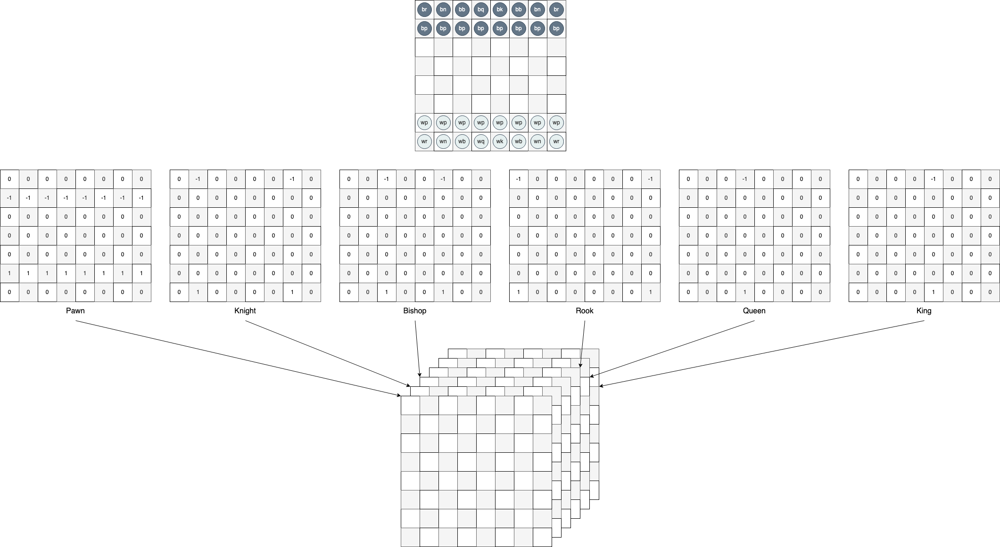
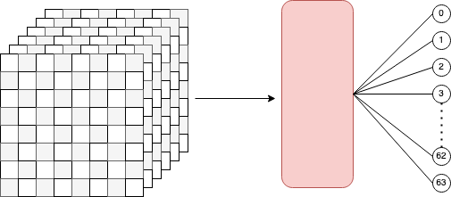
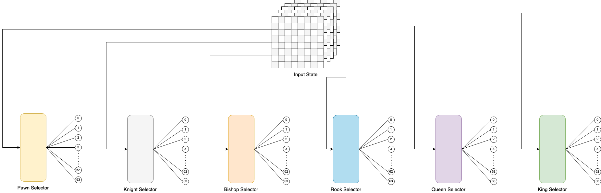
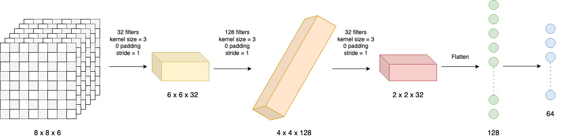

# ai-chess

This is a system where two AIs can learn to play chess by playing against each other. Training of the AI agents is supported by reinforcement learning using Deep Q-learning techniques.

## Modules

### Environment

The `environment` module is a package that creates a chess board environment and allows external programs to interact with it.
- `board.py`: contains the representation of the environment and allows applications to interact with it through its functions.
- `piece.py`: carries details of each piece in the environment, and the moves they can do
- `replay.py`: used to visualize previous games

### Brain

The `brain` module contains the neural network components that help decide which actions to perform.

The state of the environment is represented by a 3-dimensional matrix of the size (8, 8, 6). That is an 8 x 8 grid for the squares in the board, and a 1 x 6 matrix representing the type of piece in each square.



When selecting an action, an agent needs to decide which piece to move to, and where. As a result, this project contains a `piece selector` network to decide which piece to move, and a 6 `move-selector` networks for each piece to decide on the optimal location a position for each type of piece.

All of these networks take the environment's state as input.



#### Neural Network Architecture

All seven networks take the same input, which is the representation of the state of the board, and provide an output which indicates the desirability of a position in the board. As mentioned earlier, since the input state is very similar to the structure of an image, we will be using convolutional neural networks for this.



This uses a three layer CNN in the form of 32, 128, and 32 filters. After the input state is convolved, it gets flattened into 128 nodes, which thereafter produces an output of 64 nodes.

## Running the program

We can begin training the network by executing the `main.py` file.
```shell
> python main.py
```

The program records the moves made in each game and writes them to a text file in JSON format each once in every 10 games. The files are stored in a created directory called `history` in the project.

## Replay previous games

Previous games that were recorded can be visualized using the `environment/replay.py` file. Running this file requires an argument, which is the path to the file recording the moves of the game.

```shell
> python environment/replay.py "history/1628672835-episode-9-99.txt"
```
